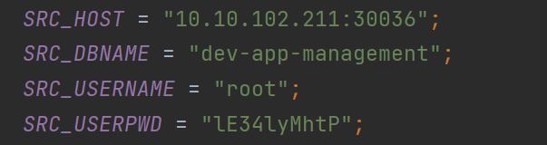
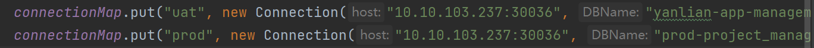
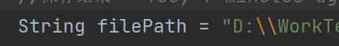
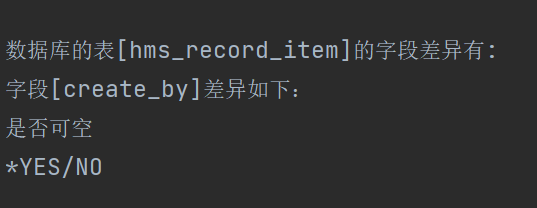

# 使用说明

需要在MainApp类中补全初始化数据,在init方法中注册需要比较的库和和标准库

以比较应用管理表为例

- 填写好主机IP、端口、账号、密码和要比较的库名
  
- 在connectionMap中添加要被对比的库,有几个要对比的库就在map中put几个对象
  
  **注意:Map的key仅仅是结果库名，方便阅读，不影响结果**
- 填写输出结果存放的路径
- 在main方法中填写结果输出的路径
  

结果查看注意:
1."/"左边的内容是当前被比对的库的结构，右边是标准库的结构。如下图,当前被对比库该字段可为空，标准库不可为空

2.整数精度差异如果为1，一般是是否无符号整数造成的